# Sparkmart: Blockchain‑Enabled Green & Secure Logistics 🚚🌱

{ .hero-image }

## Trace Every Package, Prove Every Impact

**Ever wondered how much carbon your shipment emits—or if the logistics data is tamper‑proof?**  
With Sparkmart, every pallet and package is digitally recorded and traceable end-to-end.

Traditional logistics hide data—**Sparkmart reveals it all in real time**.

---

## What is Sparkmart?

Sparkmart is our **Sparkathon** submission targeted at:

-  **Creating a sustainable future**  
-  **Building trust with cybersecurity**

…two of the four official themes from Sparkathon:  
1. Reimagining customer experience  
2. Transforming retail supply chains  
3. **Creating a sustainable future**  
4. **Building trust with cybersecurity** :contentReference[oaicite:1]{index=1}

It’s a blockchain‑powered solution that secures logistics metadata while providing full CO₂ transparency:

- 🔒 **Secure & Transparent**  
  Shipment data is hashed and stored on-chain—proprietary, immutable, and audit-ready.

- 📦 **Digital “Logistics Passports”**  
  Smart contracts mint passport tokens—like tamper-proof Bills of Lading—via SparkChain or Sepolia and MetaMask.

- 🔄 **Passport Lifecycle**  
  1. **Issuance**: Minted post-validation (label, pallet, packaging)  
  2. **Grouping**: On-chain aggregation for pallet/case handling  
  3. **CO₂ Tagging**: Toll checkpoint scans auto-update transport emissions using climatiq API

Seamlessly layered over Walmart's Yard Management System, designed for **secure, green, frictionless logistics**.

---

## 🛠 SparkMart as a Whole

=== "🔐 Phase 0: Retailer Onboard & Account Setup"
    1. Retailer creates account → receives access to **SparkChain** (Walmart blockchain – a Ganache instance on Azure).
    2. A unique **Ethereum key** is generated, enabling passport creation on SparkChain.
    3. Optionally, the retailer can connect via **MetaMask** and choose **Sepolia testnet** instead of SparkChain for passport minting.

=== "🔨 Phase 1: Add Item & Mint Passport"
    - Retailer adds an item to Sparkmart.
    - Checks run online (based on Walmart Fullfilment Services documentation):
        - Labeling 
        - Packaging 
        - Pallet
    - On passing all checks, a **Logistics Passport** is minted on the chosen blockchain (SparkChain or Sepolia).

=== "📊 Phase 1.5: Tax Calculation (Smart Tax)"
    - Passport is enriched with detailed tax data:
        - Base tax calculated via Sparkmart engine.
        - Or, retailer selects:
            - **Stripe Tax**
            - **TaxJar**
            - **Avalara**
    - Passport logs:
        - Inventory days at each warehouse
        - Storage fees
        - Fulfillment charges
        - Final tax due → reducing return loss and pricing complexity.

=== "📦 Phase 2: Aggregate with Yard Management"
    - Inspired by the previous Sparkathon Yard Management System, case- or pallet-level passports are grouped on-chain.
    - YMS updates passport metadata with movement and location events.

=== "🌍 Phase 3: eDot – Emissions Data Tagging"
    - Using **climatiq API**, combined with:
        - Packaging weight
        - Transport miles (from YMS)
        - Vehicle CO₂ at toll checkpoints
    - A complete CO₂ footprint is calculated per item.
    - Displayed via a **Gemini-generated “eDot” card** with descriptive flavor text (AI-enriched).

=== "📈 Phase 4: Dashboard & Comparison"
    - Retailers view live passport metrics:
        - Tax breakdown
        - CO₂ footprint
        - Time in warehouses
    - Compare against other retailers in the marketplace—nudging eco-conscious decision-making.

=== "🎁 Phase 5: Incentives & Rewards"
    - Items with lower tax, storage, fulfillment, and CO₂ overheads unlock on-chain **tokens/NFTs**.
    - Gamifies eco-efficient operations—rewarding responsible retail behavior.

---
## 🚀 Sparkmart Workflow & Features

```mermaid
%%{init: {'themeVariables': { 'fontSize': '14px' }}}%%
flowchart LR
  subgraph "Phase 0: Onboarding"
    A[Retailer Account Created]
    B[Receive Ethereum Key & SparkChain Access]
    C[Option: Connect MetaMask to Sepolia]
    A --> B --> C
  end

  subgraph "Phase 1: Item Upload & Passport Mint"
    D[Upload Item in Sparkmart]
    E{Checks Passed?}
    F[Mint Logistics Passport on-chain]
    D --> E -->|Yes| F
  end

  subgraph "Phase 1.5: Smart Tax Enrichment"
    G[Taxes Calculated]
    H{Provider?}
    I[Use Stripe/TaxJar/Avalara]
    J[Use Sparkmart Base Tax]
    G --> H --> I
    H --> J
    F --> G
  end

  subgraph "Phase 2: Aggregation (YMS)"
    K[Aggregate passports in pallets/cases]
    F --> K
  end

  subgraph "Phase 3: eDot Emissions"
    L[Collect transport & weight data]
    M[Compute CO₂ via climatiq]
    L --> M
    K --> L
  end

  subgraph "Phase 4: Dashboard & Comparison"
    N[View Dashboard Metrics]
    O[Compare with other retailers]
    M --> N
    K --> N --> O
  end

  subgraph "Phase 5: Green Incentives"
    P{Eco Score Passed?}
    Q[Issue Token/NFT Reward]
    N --> P -->|Yes| Q
  end
```

## 🌟 Why Sparkmart Stands Out

!!! success "Theme-FIRST Design"
    Focused on **Sustainability** & **Cybersecurity**, making it a perfect match for Sparkathon’s priorities :contentReference

!!! info "Blockchain-Native"
    Immutable smart contracts secure derivative issuance and audit trails.

!!! tip "Plug-and-Play"
    Integrates directly with existing logistics systems—no downtime or operational friction.

!!! warning "Real-world Impact"
    Tangible environmental and data integrity gains—unlike theoretical PoCs.

---

## 🏁 Ready to Ignite at Sparkathon?

Join us in building **Sparkmart**—a prototype uniting blockchain, cyber-resilience, and carbon-smart logistics.  
Let’s revolutionize retail supply chains, one shipment token at a time.

---

